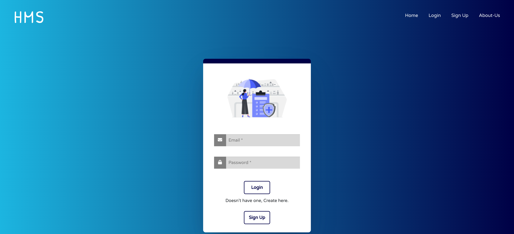
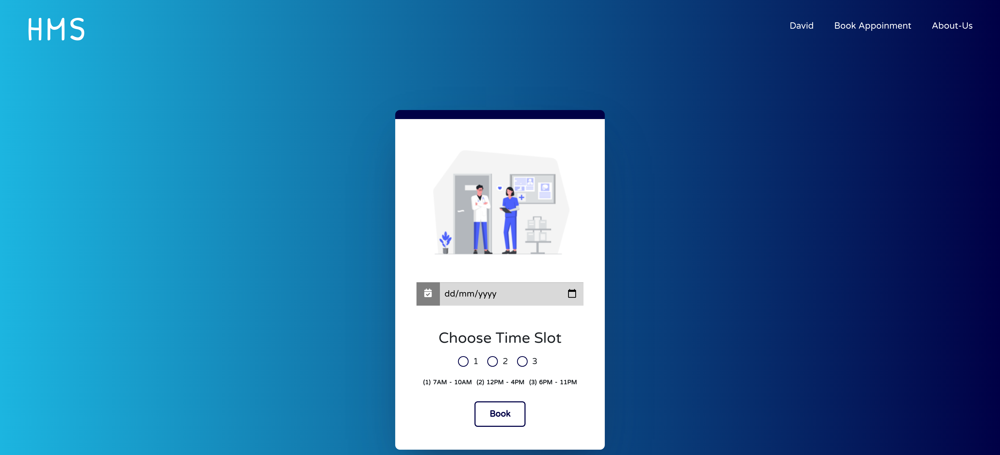
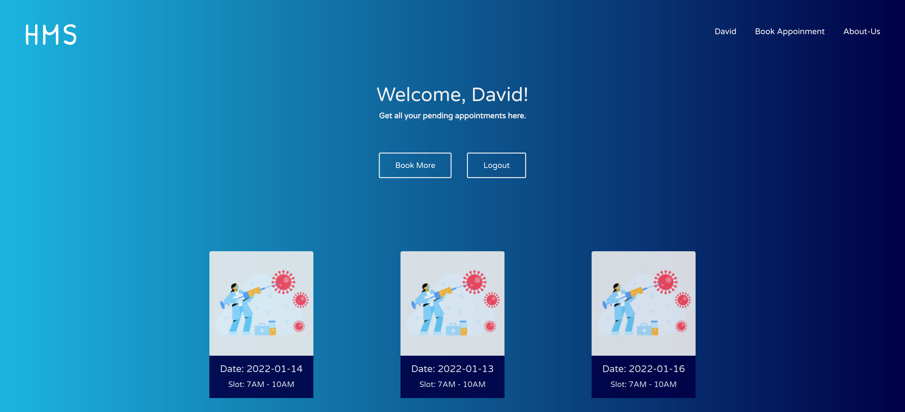
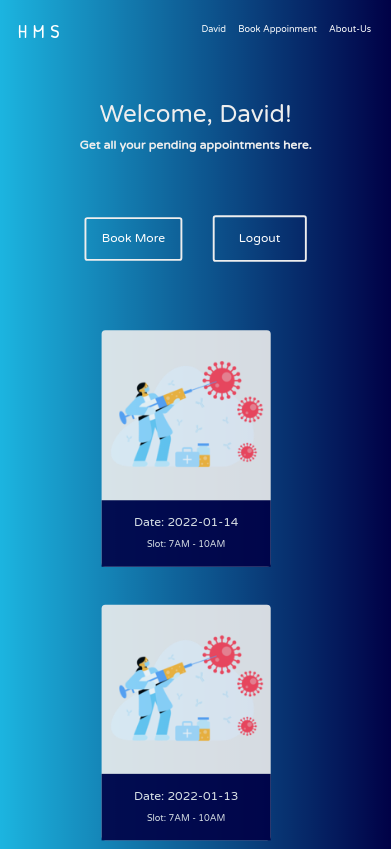

# Hospital Management System


<!-- <a href="https://hmsreact.vercel.app/">-->
  
<!-- </a> -->

## Description

A Dummy Web based applicaton for Hospitals where one can create their accounts and use our online system to book hassle free appointments.

## Tech Stack

**Client:** React


## Run Locally

Clone the project

```bash
  git clone https://github.com/Lovekush-1509/HospitalManagement-1.git
```

Go to the project directory

```bash
  cd HospitalManagement
```

Install dependencies

```bash
  npm install
```

Start the server

```bash
  npm run start
```


## Screenshots








&nbsp; &nbsp; &nbsp;
